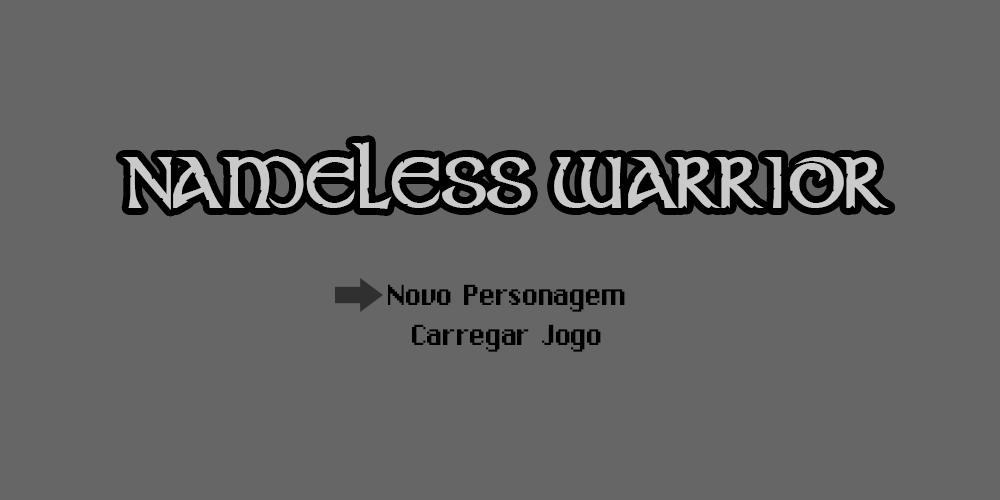

# Nameless Warrior :video_game: :european_castle:

O projeto consiste em um RPG feito totalmente com tecnologias WEB e com temáticas semelhantes aos jogos clássicos do gênero. Além disso, há uma proposta em trazer uma inteligência artificial um pouco mais avançada, apesar do visual bem simples do jogo.

Se você quiser ajudar no levantamento de informações para o jogo, responda o [formulário](http://goo.gl/forms/6TgY9Ag6F3)!

Para acompanhar o andamento do projeto, siga esse repositório e também a board do [trello](https://trello.com/b/PuE28a1W)!

## Tecnologias

* [Phaser](http://phaser.io) - Framework em Javascript que utiliza tecnologias HTML5 para fazer jogos no browser.

## Identidade Visual

Por ser um projeto de TCC, o jogo passará por toda uma fase prévia de análise. Para isso, já estou trabalhando em uma prévia da identidade visual do jogo:

## História

Ver no documento anexo sobre [história](docs/history.md).

## Classes

Todas classes terão um sprite com um visual padrão, podendo ser substituido por outro que o jogador escolher. Cada classe terá suas próprias habilidades.
	
* Guerreiro - Personagem que tem mais facilidade com armas brancas. Utiliza machados, espadas, escudos, dentre outras coisas. Pode utilizar armaduras pesadas.
* Mago - Personagem que utiliza magias para batalhar. Geralmente equipa bastões mágicos e túnica
s.
* Arqueiro - Personagem que utiliza arco e flecha para atacar. Pode utilizar armaduras/roupas leves.

## Atributos, Status e Habilidades
	
Como uma das propostas do projeto é ter uma inteligencia artificial avançada, tanto o personagem criado pelo jogador quanto os NPC(non-player characters) e monstros terão os mesmos atributos e status. Além disso, mesmo monstros da mesma espécia terão atributos diferentes, porque eles serão gerados aleatoriamente.

### Atributos		

* Força - Define a força dos ataques físicos do personagem, combinado com os pontos de ataque das armas.
* Constituição - Define a resistência e a quantidade de HP do personagem.
* Destreza/Agilidade - Define a velocidade de ataque e a chance de desviar de ataques inimigos.
* Inteligência - Define o poder das magias utilizadas pelo personagem, bem como sua facilidade em identificar itens, inimigos, etc.
* Carisma - Define o poder de persuasão do personagem ao conversar com NPCs.

### Status

* Level - Define quanto o personagem já evoluiu. Cada vez que ele sobe de nível, mais atributos e habilidades estarão disponíveis para serem distribuídos.
* HP - Os tradicionais pontos de vida, que indicam quanto dano o personagem já sofreu. Ao chegar a zero, o personagem morre e o jogo deve voltar ao último lugar onde foi salvo.
* Mana - Também tradicional nos RPGs, são os pontos que são gastos quando o personagem utiliza uma habilidade ou magia.
* Stamina - Indica o cansaço do personagem. No jogo, ações como correr, atacar, fazem o personagem perder stamina, que se recupera aos poucos. Quanto mais sono o personagem tiver, mais lento será a recuperação.
* Fome - O jogo terá itens que servirão como alimento. Ficar muito tempo sem consumir nada fará com que a fome aumente e as ações do personagem fiquem mais difíceis de se realizar.
* Sono - Assim como a fome, um personagem com muito sono terá suas ações dificultadas, assim tendo que procurar uma cama para poder descansar.

## Inteligência Artificial

A ideia de inteligência artificial que o jogo passará é de que os inimigos e NPCs tem ações parecidas com o personagem. Assim, personagens não controlados pelo jogador também dormirão, lutarão, sentirão fome. Por exemplo: um monstro carnívoro poderá lutar com outros monstros de níveis inferiores quando sentir fome, criando assim todo um ecossistema no cenário do jogo.
Além dessa partes dos status e comportamento, existirão árvores de decisão que irão definir como os NPCs e as quests(missões) respondem as escolhas do jogador, mundo do jogo com ciclos de dia/noite, chuva, sol, entre outros.